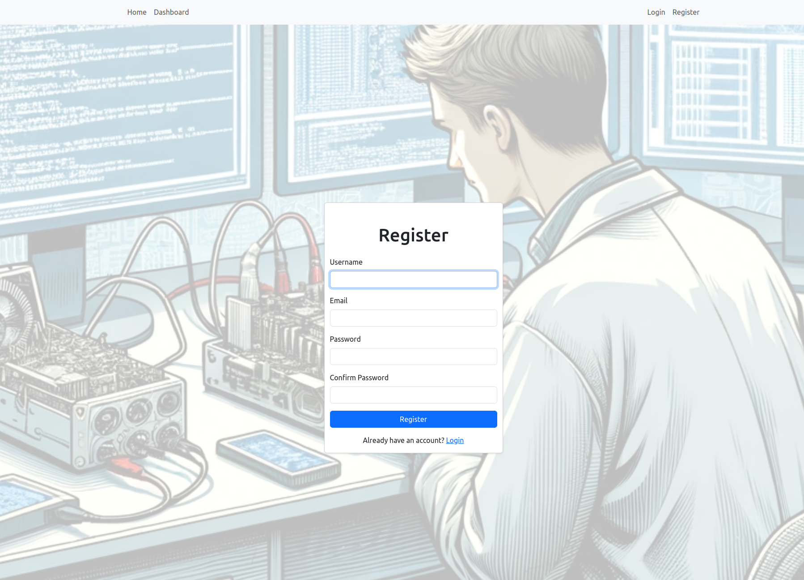
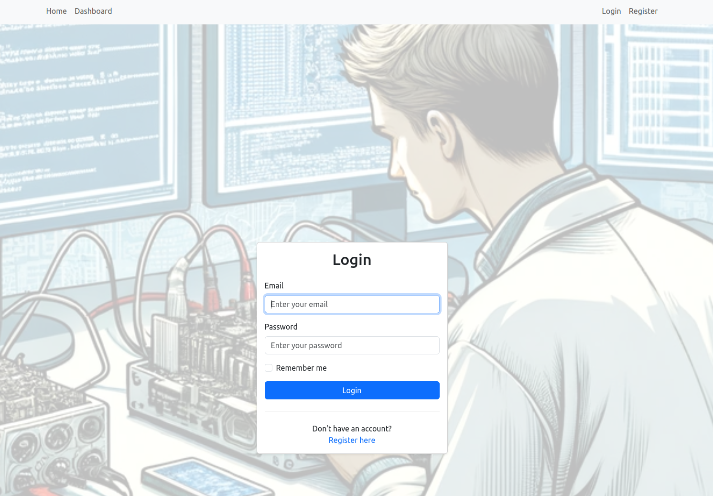
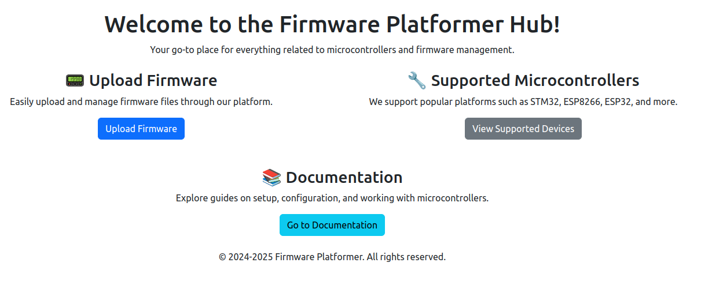
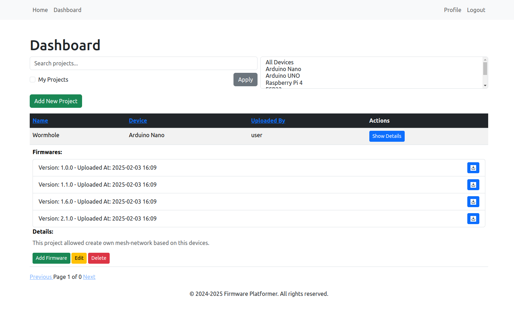
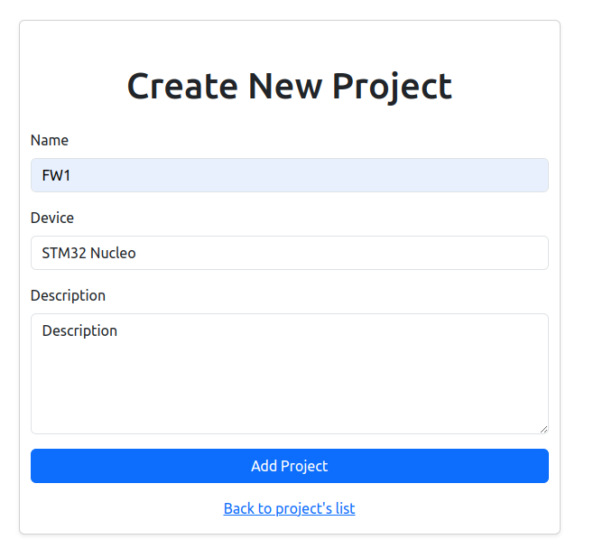
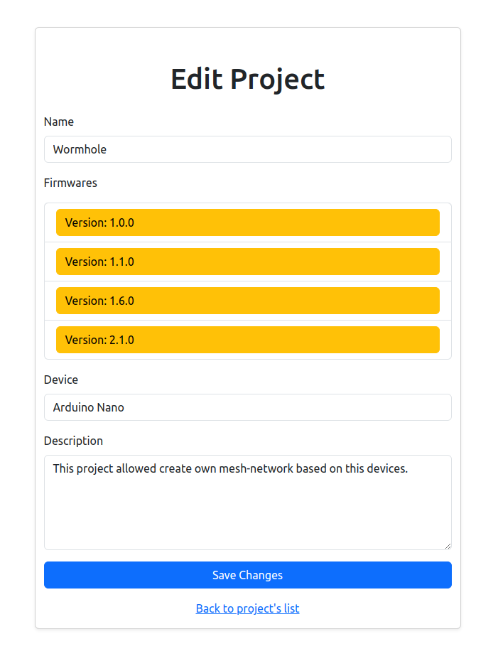
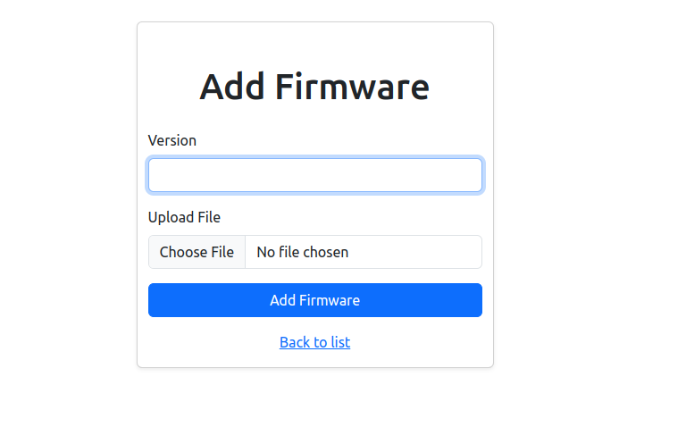
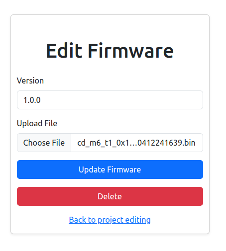
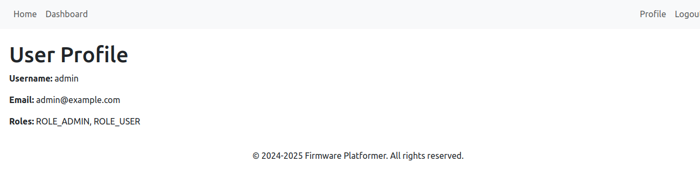
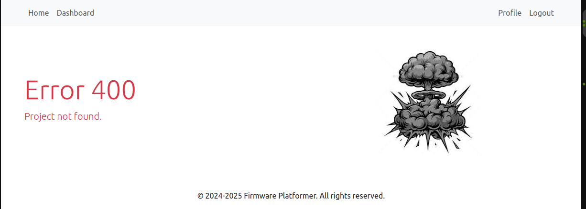

# Symfony Project 'Firmware Platformer'

## Instructions on How to Run the Application

1. [Install Docker](https://www.docker.com/)
2. Clone the repository
```bash
https://github.com/TsybukloN/symfony-project.git
cd symfony-project
```
3. Run `docker compose build --no-cache` to build fresh images
4. Run `docker compose up --pull always -d --wait` to set up and start a fresh Symfony project

### To stop and delete the Docker containers
+ Run `docker compose stop` to stop and delete the Docker containers.
+ Run `docker compose down --remove-orphans` to stop and delete the Docker containers.

5. Run `docker exec -it <container_id> php bin/console doctrine:fixtures:load` to upload to database default(test) data. (`docker ps` to see container_id used app-php image)
6. Open `https://localhost`. **Better to use your web browser**. It allows you to see the complete design of the project.
7. If you did point (5)(load fixtures) you can log in with the following credentials:

- **Login**: `user@example.com`
- **Password**: `user_password`

or

- **Login**: `admin@example.com`
- **Password**: `admin_password`

## Description and Features

This project is a Symfony-based web application that allows users to manage, upload, download firmware files and view them in a list. The application is designed to be user-friendly and easy to use. The application is built using the Symfony framework and uses Docker to manage the development environment.

### Features

- User registration and login
- User show profile
- User can view the list of projects and firmware files
- User can create, edit, delete projects, that contain firmware files with version
- User can create, edit, delete firmware files
- User can download firmware files
- User can search for firmware files by filters
- Admin can manage all the project data in the application

### Registration page



### Login page

The user can log in to the application using the login form.



### Home page with start information



### Dashboard page with the list of projects



### Create a new project page



### Edit Project page



### Edit Create page to the project



### Edit Firmware page of the project



### Profile page



### Example of Error page

Error page is displayed when the user tries to access a page that does not exist or when an error occurs.


